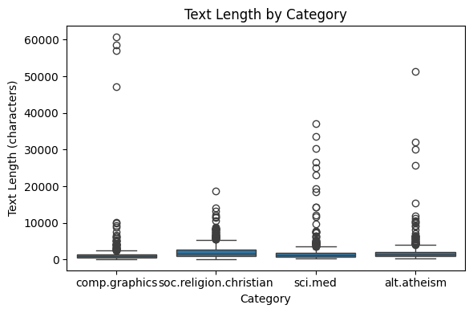
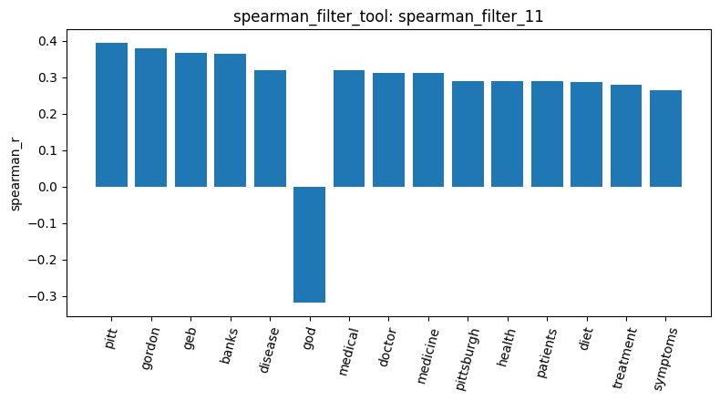
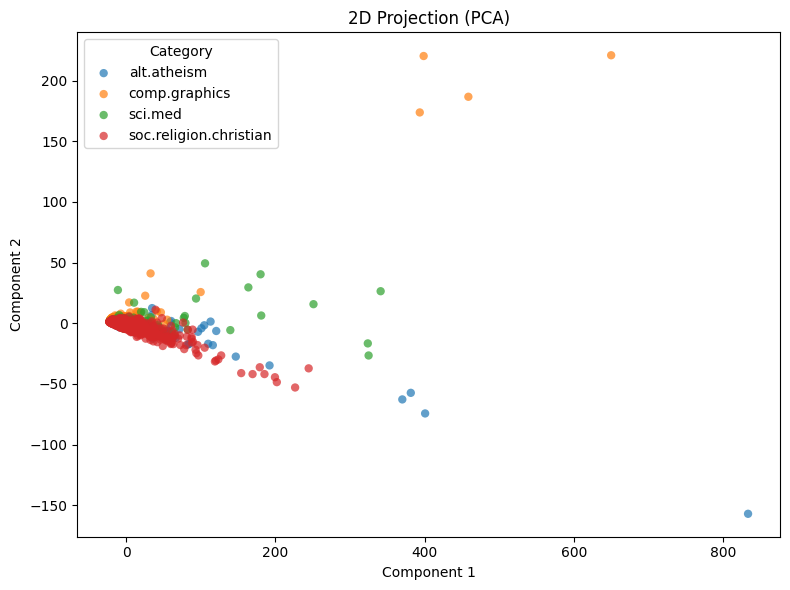

# Agentic Pipeline Report

## 1. Data
I loaded four categories from 20 Newsgroups: alt.atheism, soc.religion.christian, comp.graphics, and sci.med, with 2,257 documents in total (`load_dataset_1`). There was no missing text (`check_missing_3`) and no duplicate documents (`check_duplicates_4`), so I did not need to clean or drop anything. The text length is very right-skewed in all four categories (`describe_data_5`). Most documents are around 880 to 1,650 characters (median), but some are much longer, up to 60,713 characters in comp.graphics.

## 2. Document-term matrix
The document-term matrix has 35,788 terms and a sparsity of 99.547% (`dtm_6`). The most frequent terms are stop words like "the", "of", and "to" (`term_freq_7`). One exception is "edu" at rank 16, which comes from email addresses in the post headers. The heatmap of the first 20 terms and 20 documents (`dtm_heatmap_8`) is almost all zeros, and the terms are number-like tokens such as "000usd", which shows how sparse the matrix is.

## 3. Feature filtering
With a variance threshold of 0.01, 5,354 terms were kept and 30,434 were removed (`variance_filter_9`), so most terms are rare. However, the terms with the highest variance are still stop words, so variance alone cannot find useful words. With sci.med as the target class, the Pearson filter (`pearson_filter_10`) found terms like "pitt", "gordon", "geb", and "banks". These appear to come from the signature of one person who posts a lot in sci.med, not from medical topics. The Spearman filter (`spearman_filter_11`) only checked the top 1,500 terms by variance. The top four terms were still "pitt", "gordon", "geb", and "banks", but rarer signature words like "n3jxp" and "chastity" no longer appeared in the top results, and real medical words appeared, such as "disease", "medical", and "doctor". "god" was the only term with a negative correlation (-0.3191), which makes sense because two of the other categories are about religion. In the correlation matrix (`feat_corr_12`), stop words are very highly correlated with each other (for example, "the" and "of" at 0.9442), likely because longer documents contain more of every word.

## 4. Pattern mining
I mined patterns for each category using variance filtering and the top-k algorithm with k=10 (`patterns_13` to `patterns_16`). In all four categories, the top patterns included header words such as "subject", "lines", and "organization". The other patterns were mostly general words or numbers, such as "thanks", "00", and "05". To check whether a different filter would help, I ran sci.med again with tfidf filtering (`patterns_21`). The top patterns were still "subject", "lines", and "organization", plus "edu" (support 416). "subject" had a support of 594, which means it appears in every sci.med post. Its count is likely about the same in each post, so its variance falls in the middle range, and my variance filter, which keeps terms between the 5th and 95th percentile, does not remove it. So with either filter, pattern mining did not find clear topic words.

## 5. Dimension reduction, labels, and similarity
In the PCA plot (`reduce_dimensions_17`), most documents from all four categories overlap near the origin, so PCA does not separate the categories well. The first component explains 65.94% of the variance and the second only 4.33%. The binarized labels have shape 2,257 x 4 (`binarize_labels_18`), and the first five rows match the categories I saw in `inspect_data_2`. The cosine similarity between documents 0 and 1 (both comp.graphics) was 0.3532 (`cosine_sim_19`), and between documents 0 and 2 (comp.graphics and soc.religion.christian) it was 0.3399 (`cosine_sim_20`). I chose these documents based on the categories shown in `inspect_data_2`, so that I could compare a same-category pair with a different-category pair. In this example, the difference is very small. Since cosine similarity already removes the effect of document length, this is more likely because every post shares many stop words and header words.

Overall, my main finding is that the raw text has a lot of noise from headers, signatures, and stop words. This noise hides the topic words in many steps. To get better results, these should be removed before building the document-term matrix.