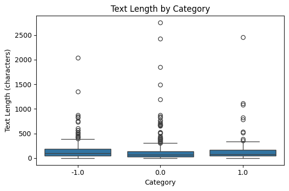
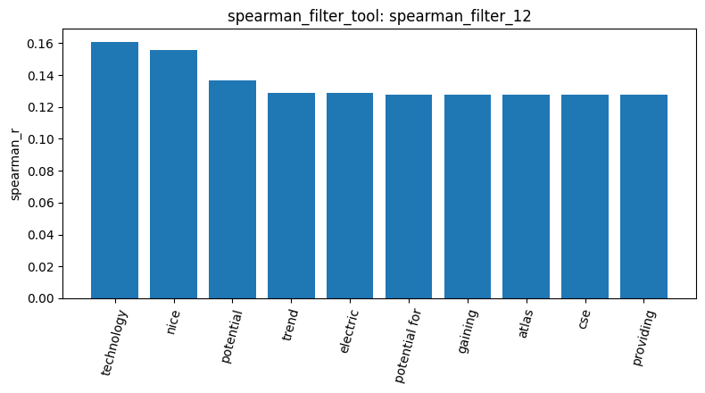
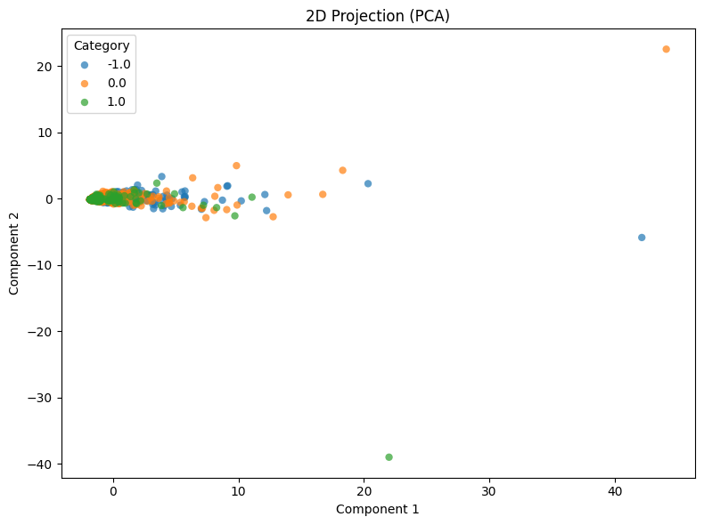

# Homework Report

## 1. Data

This project analyzes a Reddit stock sentiment dataset containing text posts labeled as negative (-1.0), neutral (0.0), or positive (1.0). The original dataset contained 847 documents (`load_dataset_1`). The duplicate check found 23 duplicate rows (`check_duplicates_4`), and after removing them, 813 documents remained (`check_duplicates_5`). The duplicate-removal procedure removed all occurrences of duplicated rows, including the original copies, rather than retaining one copy of each duplicated post.

The final dataset contains 315 negative posts, 391 neutral posts, and 107 positive posts (`describe_data_6`). No missing or empty text values were detected before duplicate removal (`check_missing_3`).

The text length statistics (`describe_data_6`) show that the posts vary considerably in length. Across all 813 documents, the mean text length was 148.31 characters, the median was 80 characters, and the maximum was 2,753 characters.

The median text lengths were 96 characters for negative posts, 68 for neutral posts, and 81 for positive posts. All three categories also contained unusually long posts. Although the distributions differ somewhat, their medians are relatively similar, suggesting that text length alone may not be sufficient to distinguish sentiment.

The duplicate-removal results also revealed an imbalance in the number of removed documents across labels. The neutral class decreased from 423 (`load_dataset_1`) to 391 documents (`describe_data_6`), the positive class decreased from 109 to 107, and the negative class remained at 315. This indicates that duplicate removal disproportionately affected neutral posts. However, the specific reasons for these duplicates cannot be established without examining their original text.

## 2. Document-term matrix

A Document-Term Matrix (DTM) was constructed using both unigrams and bigrams (`ngram_range = [1, 2]`) (`dtm_7`). This approach captures individual words as well as two-word expressions that may provide additional context in financial discussions.

The resulting matrix contains 813 documents and 19,345 features, with 35,566 nonzero elements out of 15,727,485 total matrix elements. Its sparsity is 99.77%, indicating that most terms do not occur in most documents.

The 20 most frequent terms across the dataset were common English words, including "the," "to," "and," "is," and "it" (`term_freq_8`). No stock-specific slang appeared in this top-frequency list. Since the DTM construction did not remove stop words, these common words remained among the features.

A heatmap of the first 20 documents and the first 20 alphabetically ordered terms showed that all entries in this slice were zero (`dtm_heatmap_9`). This result is consistent with the high sparsity of the matrix, although the selected slice does not represent the entire DTM.

A variance filter with a threshold of 0.01 was then applied (`variance_filter_10`). It kept 668 terms and removed 18,677 terms. The kept terms included common words with relatively high variance, while many rare words and bigrams fell below the threshold. This filter only reported which terms passed the threshold; it did not change the DTM used in later steps.

The result shows that most of the vocabulary is rare. However, the terms with the highest variance were still frequent stop words, indicating that variance filtering alone does not necessarily identify sentiment-specific features.

## 3. Feature filtering

Pearson and Spearman correlation filters were applied to identify terms associated with the positive sentiment class (1.0).

The Pearson filter (`pearson_filter_11`) returned the following top terms:

| Term       | Pearson correlation |
| ---------- | ------------------: |
| tldr       |            0.1563   |
| huge       |            0.1563   |
| main       |            0.1563   |
| nice       |            0.1555   |
| technology |            0.1525   |
| potential  |            0.1320   |
| changing   |            0.1286   |
| points     |            0.1286   |
| perfectly  |            0.1286   |
| god        |            0.1286   |

The highest Pearson correlation was only 0.1563. Interestingly, several terms had identical correlation values. One possible explanation is that some terms have identical or very similar distributions across documents. However, the correlation results alone do not establish whether these terms occur in the same posts.

The Spearman filter (`spearman_filter_12`) evaluated the top 1,500 terms by variance before ranking their correlations with the positive class. Its top terms were:

| Term          | Spearman correlation |
| ------------- | -------------------: |
| technology    |             0.1609   |
| nice          |             0.1555   |
| potential     |             0.1366   |
| trend         |             0.1287   |
| electric      |             0.1286   |
| potential for |             0.1276   |
| gaining       |             0.1276   |
| atlas         |             0.1276   |
| cse           |             0.1276   |
| providing     |             0.1276   |

Some terms, such as "technology," "nice," and "potential," appeared near the top of both rankings. Other terms, including "electric," "atlas," and "cse," appeared in the Spearman results. These words have a more formal or corporate tone than typical conversational expressions.

One possible interpretation is that some positive posts contain promotional or company-related language. For example, one positive post in `inspect_data_2` described Vision Marine Technologies in a way that read like an advertisement. Nevertheless, this remains a hypothesis because the analysis did not inspect all posts containing these terms or establish whether they were advertisements, press releases, or ordinary user comments.

The Spearman results are visualized below.

The correlation heatmap of the 20 highest-variance terms (`feat_corr_13`) also showed positive associations among common words, with the strongest reported correlation being approximately 0.69. These associations indicate that some frequent words tend to occur together, but they do not necessarily represent meaningful sentiment relationships.

Overall, the correlation results suggest that the relationship between individual terms and positive sentiment is relatively weak. The presence of common words and the sparsity of short Reddit posts may make it difficult to identify clear sentiment-related patterns using these filters alone.

## 4. Pattern mining

Pattern mining was performed separately for the positive, negative, and neutral classes. The term-frequency filter retained terms between the 5th and 95th percentiles, and the top-k algorithm (FAE) with k=10 was used to identify the top 10 frequent patterns in each class.

All 10 patterns returned for each class were single-word itemsets.

### Positive posts (1.0)

The top patterns (`patterns_14`) all had a support count of 3:

| Term      | Support |
| --------- | ------: |
| come      |       3 |
| main      |       3 |
| making    |       3 |
| points    |       3 |
| tldr      |       3 |
| green     |       3 |
| perfectly |       3 |
| hey       |       3 |
| worth     |       3 |
| countries |       3 |

These patterns were relatively generic rather than clearly associated with stock-market sentiment. Several terms, including "main," "points," "tldr," and "perfectly," also appeared among the highly correlated terms in the Pearson results (`pearson_filter_11`).

The recurrence of these terms across analyses suggests that they deserve further examination. However, their support counts indicate that each term appeared in three posts within the positive class; they do not establish that the terms occurred together in the same posts.

### Negative posts (-1.0)

The top patterns (`patterns_15`) all had a support count of 5:

| Term       | Support |
| ---------- | ------: |
| weeks      |       5 |
| let        |       5 |
| maybe      |       5 |
| does       |       5 |
| office     |       5 |
| idea       |       5 |
| delusional |       5 |
| idiot      |       5 |
| risk       |       5 |
| retarded   |       5 |

Compared with the positive patterns, the negative results included more explicitly hostile or judgmental terms, such as "delusional," "idiot," and "retarded." This suggests that some negative posts may express sentiment through direct insults or strongly negative language.

Nevertheless, the top patterns alone do not establish the overall linguistic characteristics of every negative post.

### Neutral posts (0.0)

The top patterns (`patterns_16`) also had a support count of 5:

| Term     | Support |
| -------- | ------: |
| red      |       5 |
| pretty   |       5 |
| usa      |       5 |
| thoughts |       5 |
| 2025     |       5 |
| actually |       5 |
| anymore  |       5 |
| cost     |       5 |
| country  |       5 |
| debt     |       5 |

The term "red" is particularly interesting because one inspected neutral post stated, "Seeing lots of red in the ticker" (`inspect_data_2`). This example shows that a reference to "red" in a stock-market context can occur in a post labeled neutral.

However, the other neutral posts containing "red" were not inspected. Because the same pattern list also contains terms such as "usa," "country," and "debt," it is not possible to determine whether all occurrences of "red" refer to stock prices or whether some concern other topics.

Taken together, the pattern-mining results reveal differences among the top terms in each sentiment class. The negative class includes several insulting expressions, while the positive and neutral classes contain more varied and less obviously sentiment-specific vocabulary. Since the patterns were restricted by percentile-based term-frequency filtering and all returned itemsets were single words, further analysis would be needed to identify more informative multi-word expressions.

## 5. PCA, labels, and similarity

Principal Component Analysis (PCA) was applied to reduce the DTM to two dimensions, with each document colored according to its sentiment label (`reduce_dimensions_17`).

The analysis processed all 813 documents. The first principal component explained 17.34% of the variance, while the second explained 4.24%.

The PCA plot shows substantial overlap among the negative, neutral, and positive documents. This indicates that the first two principal components do not provide a clear separation of the three sentiment classes.

The relatively low explained variance also means that the two-dimensional representation captures only part of the information contained in the original high-dimensional DTM. Although the overlap is consistent with the weak individual-term correlations observed earlier, it does not establish that sentiment cannot be distinguished using other features or methods.

The labels were also converted into a one-hot encoded matrix with 813 rows and three columns, corresponding to the negative (-1.0), neutral (0.0), and positive (1.0) classes (`binarize_labels_18`).

Cosine similarity was then calculated for two pairs of documents:

* **Documents 0 and 4 (`cosine_sim_19`):** Both were labeled negative. Document 0 contained "Calls on retards," while Document 4 contained "He didn’t say thank you." Their cosine similarity was 0.0 because they shared no terms in the evaluated term-count vectors.
* **Documents 0 and 3 (`cosine_sim_20`):** Document 0 was negative, while Document 3 was positive and contained a description of Vision Marine Technologies. Their cosine similarity was 0.0365, likely partly due to a shared common word such as "on."

Interestingly, the negative-positive pair had a higher cosine similarity than the two negative posts. This illustrates that cosine similarity based on raw term counts measures lexical overlap rather than sentiment agreement. Documents with the same label may use entirely different words, while documents with different labels may share common words.

Therefore, the two examples demonstrate a limitation of using raw DTM cosine similarity as a direct measure of sentiment similarity. They do not, by themselves, establish how well cosine similarity performs across the entire dataset.

## Conclusion

This project explored a Reddit stock sentiment dataset through data description, document-term matrix construction, feature filtering, pattern mining, PCA, and cosine similarity.

After duplicate removal, the dataset contained 813 documents: 315 negative, 391 neutral, and 107 positive posts. The text-length distributions had relatively similar medians across the three classes, suggesting that text length alone may have limited usefulness for distinguishing sentiment.

The DTM contained 19,345 unigram and bigram features and was 99.77% sparse. Variance filtering kept only 668 terms above the 0.01 threshold. However, common English stop words remained prominent, and the Pearson and Spearman filters returned relatively weak correlations with the positive class. These results suggest that raw term frequencies and individual-term correlations may not adequately capture the sentiment expressed in short social media posts.

Pattern mining revealed several differences among the classes. The negative class included terms such as "delusional" and "idiot," while the positive class contained terms such as "technology" and "potential" in the correlation analysis. These findings raise the possibility that some positive posts use promotional language, but this interpretation has not been verified through systematic inspection of the underlying posts. Similarly, the presence of "red" in neutral posts raises questions about the labeling of financial expressions, but the available results are insufficient to establish a general labeling rule.

PCA showed substantial overlap among the three sentiment classes in two dimensions, with the two components explaining only 17.34% and 4.24% of the variance. The cosine similarity examples also demonstrated that shared vocabulary does not necessarily imply shared sentiment.

If this analysis were repeated, the first improvement would be to remove common stop words and apply TF-IDF weighting before calculating document similarities or performing dimensionality reduction. These changes could reduce the influence of generic words and give more weight to informative terms. Inspecting duplicated posts and representative posts from each sentiment class would also help evaluate possible label noise and determine whether promotional language is genuinely prevalent in the positive class.

Overall, the results highlight the limitations of relying solely on raw word counts and individual-term associations to analyze sentiment in short Reddit posts. More targeted preprocessing and closer examination of the underlying text would be useful next steps for improving the analysis.
